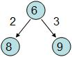
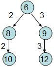
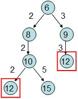
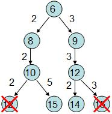

# UVA 11730

## Solution
每做一次轉換都要重算一次A的質因數，所以為了節省時間先建質數表是必須的。

然後我們就可以從S這個數字開始建出一個搜尋樹，利用BFS的方式找出答案。

但單純用BFS搜尋所有的展開可能會TLE，所以可利用Branch-and-Bound的策略對BFS加速。


以S = 6開始，6有兩個質因數2與3：


 
 接著對8跟9展開，8只有一個質因數2，9也只有一個質因數3：



接著對10展開，10有兩個質因數2、5： 



由於這顆搜尋樹的深度就是題目要求的轉換的次數，而這時我們發現12的node出現了兩次，所以對這兩個node來說底下若繼續再展開，他們的subtree會是相同的。既然展開的結果會相同，左邊的12展開後的subtree即使有包含答案的node，層數也絕對會比右邊的12所展開的還要深，因此左邊層數較深的12就沒有繼續展開的必要了。

所以我們繼續展開右邊的12，12有兩個質因數2、3：



此時我們發現15的node又出現了兩次，而這兩個node一樣會展開相同的subtree，由於這兩個node所位在的深度相同，我們只要展開其中一個就可以了，不需要兩個都展開。


依此類推直到找出答案T的值為止。

對BFS的演算法來說，我們只要另外記錄展開後的數字在之前有沒有出現過，如果這個被展開的數字已經出現過了，則這個重複的數字我們就不將他push到BFS的queue中，這樣就不會展開重複的subtree來拖累搜尋時間了。

## Breadth-first search(BFS)
Breadth-first search (BFS) is an algorithm for traversing or searching tree or graph data structures. It starts at the tree root (or some arbitrary node of a graph, sometimes referred to as a 'search key'), and explores all of the neighbor nodes at the present depth prior to moving on to the nodes at the next depth level.

It uses the opposite strategy of depth-first search, which instead explores the node branch as far as possible before being forced to backtrack and expand other nodes.

#### Pseudocode
```
procedure BFS(G, root) is
    let Q be a queue
    label root as discovered
    Q.enqueue(root)
    while Q is not empty do
        v := Q.dequeue()
        if v is the goal then
            return v
        for all edges from v to w in G.adjacentEdges(v) do
            if w is not labeled as discovered then
                label w as discovered
                Q.enqueue(w)
```

## std::queue

FIFO queue
queues are a type of container adaptor, specifically designed to operate in a FIFO context (first-in first-out), where elements are inserted into one end of the container and extracted from the other.

queues are implemented as containers adaptors, which are classes that use an encapsulated object of a specific container class as its underlying container, providing a specific set of member functions to access its elements. Elements are pushed into the "back" of the specific container and popped from its "front".

#### Member functions
| Name   | Explanation   |
|----|----|
|(constructor)|Construct queue (public member function )|
|empty|Test whether container is empty (public member function )|
|size|Return size (public member function )|
|front|Access next element (public member function )|
|back|Access last element (public member function )|
|push|Insert element (public member function )|
|emplace|Construct and insert element (public member function )|
|pop|Remove next element (public member function )|
|swap|Swap contents (public member function )|


## Find Prime number
```
vector<int> findPrimeNumber(int low, int high)
{
    vector<int> primeNumber;
    while (low < high) {
        isPrime = true;
        if (low == 0 || low == 1) {
            isPrime = false;
        }
        else {
            for (i = 2; i <= low / 2; ++i) {
                if (low % i == 0) {
                    isPrime = false;
                    break;
                }
            }
        }
        
        if (isPrime)
            primeNumber.push_back(low);
        ++low;
    }

    return primeNumber;
}

```
## Reference: 
題目解法：https://kos74185foracm.blogspot.com/2013/07/11730-number-transformation.html

Breadth-first search(BFS): https://en.wikipedia.org/wiki/Breadth-first_search

Queue: https://www.cplusplus.com/reference/queue/queue/
Find Prime number: https://www.programiz.com/cpp-programming/examples/prime-number-intervals
